
# DreamPlacer
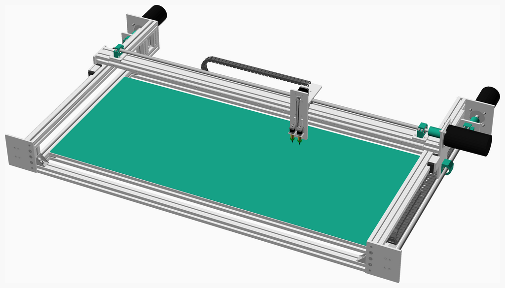

---
## Table of Contents
1. [Parts list](#Parts_list)
1. [Left Side Frame Assembly](#left_side_frame_assembly)
1. [Right Side Frame Assembly](#right_side_frame_assembly)
1. [Picker Assembly](#picker_assembly)
1. [Head Assembly](#head_assembly)
1. [Xaxis Assembly](#xaxis_assembly)
1. [Frame Assembly](#frame_assembly)
1. [Main Assembly](#main_assembly)

[Top](#TOP)

---

## Parts list
| Left&nbsp;Side&nbsp;Frame | Right&nbsp;Side&nbsp;Frame | Picker | Head | Xaxis | Frame | Main | TOTALS |  |
|---:|---:|---:|---:|---:|---:|---:|---:|:---|
|  |  |  |  |  |  |  | | **Vitamins** |
| &nbsp;&nbsp;.&nbsp; | &nbsp;&nbsp;.&nbsp; | &nbsp;&nbsp;.&nbsp; | &nbsp;&nbsp;1&nbsp; | &nbsp;&nbsp;.&nbsp; | &nbsp;&nbsp;.&nbsp; | &nbsp;&nbsp;.&nbsp; |  &nbsp;&nbsp;1&nbsp; | &nbsp;&nbsp; Aluminium tooling plate 100mm x 114mm x 8mm |
| &nbsp;&nbsp;.&nbsp; | &nbsp;&nbsp;.&nbsp; | &nbsp;&nbsp;.&nbsp; | &nbsp;&nbsp;1&nbsp; | &nbsp;&nbsp;.&nbsp; | &nbsp;&nbsp;.&nbsp; | &nbsp;&nbsp;.&nbsp; |  &nbsp;&nbsp;1&nbsp; | &nbsp;&nbsp; Aluminium tooling plate 100mm x 240mm x 8mm |
| &nbsp;&nbsp;.&nbsp; | &nbsp;&nbsp;.&nbsp; | &nbsp;&nbsp;.&nbsp; | &nbsp;&nbsp;.&nbsp; | &nbsp;&nbsp;1&nbsp; | &nbsp;&nbsp;.&nbsp; | &nbsp;&nbsp;.&nbsp; |  &nbsp;&nbsp;1&nbsp; | &nbsp;&nbsp; Aluminium tooling plate 100mm x 250mm x 8mm |
| &nbsp;&nbsp;.&nbsp; | &nbsp;&nbsp;.&nbsp; | &nbsp;&nbsp;.&nbsp; | &nbsp;&nbsp;.&nbsp; | &nbsp;&nbsp;.&nbsp; | &nbsp;&nbsp;.&nbsp; | &nbsp;&nbsp;1&nbsp; |  &nbsp;&nbsp;1&nbsp; | &nbsp;&nbsp; Aluminium tooling plate 1500mm x 645mm x 2mm |
| &nbsp;&nbsp;1&nbsp; | &nbsp;&nbsp;1&nbsp; | &nbsp;&nbsp;.&nbsp; | &nbsp;&nbsp;.&nbsp; | &nbsp;&nbsp;.&nbsp; | &nbsp;&nbsp;.&nbsp; | &nbsp;&nbsp;.&nbsp; |  &nbsp;&nbsp;2&nbsp; | &nbsp;&nbsp; Aluminium tooling plate 160mm x 160mm x 8mm |
| &nbsp;&nbsp;.&nbsp; | &nbsp;&nbsp;.&nbsp; | &nbsp;&nbsp;4&nbsp; | &nbsp;&nbsp;.&nbsp; | &nbsp;&nbsp;.&nbsp; | &nbsp;&nbsp;.&nbsp; | &nbsp;&nbsp;.&nbsp; |  &nbsp;&nbsp;4&nbsp; | &nbsp;&nbsp; Aluminium tooling plate 30mm x 30mm x 2mm |
| &nbsp;&nbsp;.&nbsp; | &nbsp;&nbsp;.&nbsp; | &nbsp;&nbsp;.&nbsp; | &nbsp;&nbsp;.&nbsp; | &nbsp;&nbsp;2&nbsp; | &nbsp;&nbsp;.&nbsp; | &nbsp;&nbsp;.&nbsp; |  &nbsp;&nbsp;2&nbsp; | &nbsp;&nbsp; Aluminium tooling plate 50mm x 50mm x 8mm |
| &nbsp;&nbsp;.&nbsp; | &nbsp;&nbsp;.&nbsp; | &nbsp;&nbsp;.&nbsp; | &nbsp;&nbsp;.&nbsp; | &nbsp;&nbsp;2&nbsp; | &nbsp;&nbsp;.&nbsp; | &nbsp;&nbsp;.&nbsp; |  &nbsp;&nbsp;2&nbsp; | &nbsp;&nbsp; Aluminium tooling plate 50mm x 50mm x 8mm |
| &nbsp;&nbsp;.&nbsp; | &nbsp;&nbsp;.&nbsp; | &nbsp;&nbsp;.&nbsp; | &nbsp;&nbsp;.&nbsp; | &nbsp;&nbsp;2&nbsp; | &nbsp;&nbsp;.&nbsp; | &nbsp;&nbsp;.&nbsp; |  &nbsp;&nbsp;2&nbsp; | &nbsp;&nbsp; Aluminium tooling plate 60mm x 80mm x 8mm |
| &nbsp;&nbsp;.&nbsp; | &nbsp;&nbsp;.&nbsp; | &nbsp;&nbsp;.&nbsp; | &nbsp;&nbsp;.&nbsp; | &nbsp;&nbsp;1&nbsp; | &nbsp;&nbsp;.&nbsp; | &nbsp;&nbsp;.&nbsp; |  &nbsp;&nbsp;1&nbsp; | &nbsp;&nbsp; Aluminium tooling plate 80mm x 100mm x 8mm |
| &nbsp;&nbsp;3&nbsp; | &nbsp;&nbsp;3&nbsp; | &nbsp;&nbsp;.&nbsp; | &nbsp;&nbsp;.&nbsp; | &nbsp;&nbsp;3&nbsp; | &nbsp;&nbsp;.&nbsp; | &nbsp;&nbsp;.&nbsp; |  &nbsp;&nbsp;9&nbsp; | &nbsp;&nbsp; Ball bearing 6201-2RS 12mm x 32mm x 10mm |
| &nbsp;&nbsp;2&nbsp; | &nbsp;&nbsp;2&nbsp; | &nbsp;&nbsp;.&nbsp; | &nbsp;&nbsp;.&nbsp; | &nbsp;&nbsp;.&nbsp; | &nbsp;&nbsp;.&nbsp; | &nbsp;&nbsp;.&nbsp; |  &nbsp;&nbsp;4&nbsp; | &nbsp;&nbsp; Extrusion E4040 x 1070mm |
| &nbsp;&nbsp;.&nbsp; | &nbsp;&nbsp;.&nbsp; | &nbsp;&nbsp;.&nbsp; | &nbsp;&nbsp;.&nbsp; | &nbsp;&nbsp;.&nbsp; | &nbsp;&nbsp;5&nbsp; | &nbsp;&nbsp;.&nbsp; |  &nbsp;&nbsp;5&nbsp; | &nbsp;&nbsp; Extrusion E4040 x 1500mm |
| &nbsp;&nbsp;3&nbsp; | &nbsp;&nbsp;3&nbsp; | &nbsp;&nbsp;.&nbsp; | &nbsp;&nbsp;.&nbsp; | &nbsp;&nbsp;.&nbsp; | &nbsp;&nbsp;.&nbsp; | &nbsp;&nbsp;.&nbsp; |  &nbsp;&nbsp;6&nbsp; | &nbsp;&nbsp; Extrusion E4040 x 80mm |
| &nbsp;&nbsp;.&nbsp; | &nbsp;&nbsp;.&nbsp; | &nbsp;&nbsp;.&nbsp; | &nbsp;&nbsp;.&nbsp; | &nbsp;&nbsp;1&nbsp; | &nbsp;&nbsp;.&nbsp; | &nbsp;&nbsp;.&nbsp; |  &nbsp;&nbsp;1&nbsp; | &nbsp;&nbsp; Extrusion E4080 x 1640mm |
| &nbsp;&nbsp;.&nbsp; | &nbsp;&nbsp;.&nbsp; | &nbsp;&nbsp;.&nbsp; | &nbsp;&nbsp;.&nbsp; | &nbsp;&nbsp;1&nbsp; | &nbsp;&nbsp;.&nbsp; | &nbsp;&nbsp;.&nbsp; |  &nbsp;&nbsp;1&nbsp; | &nbsp;&nbsp; Leadscrew 16 x 1435mm, 10mm lead, 1 starts |
| &nbsp;&nbsp;1&nbsp; | &nbsp;&nbsp;1&nbsp; | &nbsp;&nbsp;.&nbsp; | &nbsp;&nbsp;.&nbsp; | &nbsp;&nbsp;.&nbsp; | &nbsp;&nbsp;.&nbsp; | &nbsp;&nbsp;.&nbsp; |  &nbsp;&nbsp;2&nbsp; | &nbsp;&nbsp; Leadscrew 16 x 935mm, 10mm lead, 1 starts |
| &nbsp;&nbsp;1&nbsp; | &nbsp;&nbsp;1&nbsp; | &nbsp;&nbsp;.&nbsp; | &nbsp;&nbsp;.&nbsp; | &nbsp;&nbsp;1&nbsp; | &nbsp;&nbsp;.&nbsp; | &nbsp;&nbsp;.&nbsp; |  &nbsp;&nbsp;3&nbsp; | &nbsp;&nbsp; Leadscrew nut for SFU1610 |
| &nbsp;&nbsp;.&nbsp; | &nbsp;&nbsp;.&nbsp; | &nbsp;&nbsp;.&nbsp; | &nbsp;&nbsp;.&nbsp; | &nbsp;&nbsp;1&nbsp; | &nbsp;&nbsp;.&nbsp; | &nbsp;&nbsp;.&nbsp; |  &nbsp;&nbsp;1&nbsp; | &nbsp;&nbsp; Linear rail HGH15CA x 1500mm |
| &nbsp;&nbsp;1&nbsp; | &nbsp;&nbsp;1&nbsp; | &nbsp;&nbsp;.&nbsp; | &nbsp;&nbsp;.&nbsp; | &nbsp;&nbsp;.&nbsp; | &nbsp;&nbsp;.&nbsp; | &nbsp;&nbsp;.&nbsp; |  &nbsp;&nbsp;2&nbsp; | &nbsp;&nbsp; Linear rail HGH20CA x 1000mm |
| &nbsp;&nbsp;.&nbsp; | &nbsp;&nbsp;.&nbsp; | &nbsp;&nbsp;2&nbsp; | &nbsp;&nbsp;.&nbsp; | &nbsp;&nbsp;.&nbsp; | &nbsp;&nbsp;.&nbsp; | &nbsp;&nbsp;.&nbsp; |  &nbsp;&nbsp;2&nbsp; | &nbsp;&nbsp; Linear rail MGN7 x 200mm |
| &nbsp;&nbsp;4&nbsp; | &nbsp;&nbsp;4&nbsp; | &nbsp;&nbsp;.&nbsp; | &nbsp;&nbsp;.&nbsp; | &nbsp;&nbsp;4&nbsp; | &nbsp;&nbsp;.&nbsp; | &nbsp;&nbsp;.&nbsp; |  &nbsp;&nbsp;12&nbsp; | &nbsp;&nbsp; Nut M5 x 4mm nyloc |
| &nbsp;&nbsp;.&nbsp; | &nbsp;&nbsp;.&nbsp; | &nbsp;&nbsp;16&nbsp; | &nbsp;&nbsp;.&nbsp; | &nbsp;&nbsp;.&nbsp; | &nbsp;&nbsp;.&nbsp; | &nbsp;&nbsp;.&nbsp; |  &nbsp;&nbsp;16&nbsp; | &nbsp;&nbsp; Screw M2 cs cap x  6mm |
| &nbsp;&nbsp;.&nbsp; | &nbsp;&nbsp;.&nbsp; | &nbsp;&nbsp;.&nbsp; | &nbsp;&nbsp;8&nbsp; | &nbsp;&nbsp;.&nbsp; | &nbsp;&nbsp;.&nbsp; | &nbsp;&nbsp;.&nbsp; |  &nbsp;&nbsp;8&nbsp; | &nbsp;&nbsp; Screw M3 cs cap x 10mm |
| &nbsp;&nbsp;4&nbsp; | &nbsp;&nbsp;4&nbsp; | &nbsp;&nbsp;.&nbsp; | &nbsp;&nbsp;.&nbsp; | &nbsp;&nbsp;4&nbsp; | &nbsp;&nbsp;.&nbsp; | &nbsp;&nbsp;.&nbsp; |  &nbsp;&nbsp;12&nbsp; | &nbsp;&nbsp; Screw M5 cap x 24mm |
| &nbsp;&nbsp;6&nbsp; | &nbsp;&nbsp;6&nbsp; | &nbsp;&nbsp;.&nbsp; | &nbsp;&nbsp;.&nbsp; | &nbsp;&nbsp;.&nbsp; | &nbsp;&nbsp;.&nbsp; | &nbsp;&nbsp;.&nbsp; |  &nbsp;&nbsp;12&nbsp; | &nbsp;&nbsp; Screw M5 cs cap x 40mm |
| &nbsp;&nbsp;1&nbsp; | &nbsp;&nbsp;1&nbsp; | &nbsp;&nbsp;.&nbsp; | &nbsp;&nbsp;.&nbsp; | &nbsp;&nbsp;1&nbsp; | &nbsp;&nbsp;.&nbsp; | &nbsp;&nbsp;.&nbsp; |  &nbsp;&nbsp;3&nbsp; | &nbsp;&nbsp; Servo 80ST standard mount 90 x 178mm |
| &nbsp;&nbsp;1&nbsp; | &nbsp;&nbsp;1&nbsp; | &nbsp;&nbsp;.&nbsp; | &nbsp;&nbsp;.&nbsp; | &nbsp;&nbsp;1&nbsp; | &nbsp;&nbsp;.&nbsp; | &nbsp;&nbsp;.&nbsp; |  &nbsp;&nbsp;3&nbsp; | &nbsp;&nbsp; Smooth rod 10mm x 15mm |
| &nbsp;&nbsp;1&nbsp; | &nbsp;&nbsp;1&nbsp; | &nbsp;&nbsp;.&nbsp; | &nbsp;&nbsp;.&nbsp; | &nbsp;&nbsp;1&nbsp; | &nbsp;&nbsp;.&nbsp; | &nbsp;&nbsp;.&nbsp; |  &nbsp;&nbsp;3&nbsp; | &nbsp;&nbsp; Smooth rod 12mm x 15mm |
| &nbsp;&nbsp;1&nbsp; | &nbsp;&nbsp;1&nbsp; | &nbsp;&nbsp;.&nbsp; | &nbsp;&nbsp;.&nbsp; | &nbsp;&nbsp;1&nbsp; | &nbsp;&nbsp;.&nbsp; | &nbsp;&nbsp;.&nbsp; |  &nbsp;&nbsp;3&nbsp; | &nbsp;&nbsp; Smooth rod 12mm x 50mm |
| &nbsp;&nbsp;.&nbsp; | &nbsp;&nbsp;.&nbsp; | &nbsp;&nbsp;.&nbsp; | &nbsp;&nbsp;1&nbsp; | &nbsp;&nbsp;.&nbsp; | &nbsp;&nbsp;.&nbsp; | &nbsp;&nbsp;.&nbsp; |  &nbsp;&nbsp;1&nbsp; | &nbsp;&nbsp; Stepper motor NEMA17 x 47mm |
| &nbsp;&nbsp;.&nbsp; | &nbsp;&nbsp;.&nbsp; | &nbsp;&nbsp;2&nbsp; | &nbsp;&nbsp;.&nbsp; | &nbsp;&nbsp;.&nbsp; | &nbsp;&nbsp;.&nbsp; | &nbsp;&nbsp;.&nbsp; |  &nbsp;&nbsp;2&nbsp; | &nbsp;&nbsp; Stepper motor NEMA8 x 30mm |
| &nbsp;&nbsp;4&nbsp; | &nbsp;&nbsp;4&nbsp; | &nbsp;&nbsp;.&nbsp; | &nbsp;&nbsp;.&nbsp; | &nbsp;&nbsp;4&nbsp; | &nbsp;&nbsp;.&nbsp; | &nbsp;&nbsp;.&nbsp; |  &nbsp;&nbsp;12&nbsp; | &nbsp;&nbsp; Washer  M5 x 10mm x 1mm |
| &nbsp;&nbsp;34&nbsp; | &nbsp;&nbsp;34&nbsp; | &nbsp;&nbsp;24&nbsp; | &nbsp;&nbsp;11&nbsp; | &nbsp;&nbsp;31&nbsp; | &nbsp;&nbsp;5&nbsp; | &nbsp;&nbsp;1&nbsp; | &nbsp;&nbsp;140&nbsp; | &nbsp;&nbsp;Total vitamins count |

[Top](#TOP)

---

## Left Side Frame Assembly
### Vitamins
|Qty|Description|
|---:|:----------|
|1| Aluminium tooling plate 160mm x 160mm x 8mm|
|3| Ball bearing 6201-2RS 12mm x 32mm x 10mm|
|2| Extrusion E4040 x 1070mm|
|3| Extrusion E4040 x 80mm|
|1| Leadscrew 16 x 935mm, 10mm lead, 1 starts|
|1| Leadscrew nut for SFU1610|
|1| Linear rail HGH20CA x 1000mm|
|4| Nut M5 x 4mm nyloc|
|4| Screw M5 cap x 24mm|
|6| Screw M5 cs cap x 40mm|
|1| Servo 80ST standard mount 90 x 178mm|
|1| Smooth rod 10mm x 15mm|
|1| Smooth rod 12mm x 15mm|
|1| Smooth rod 12mm x 50mm|
|4| Washer  M5 x 10mm x 1mm|

### Assembly instructions
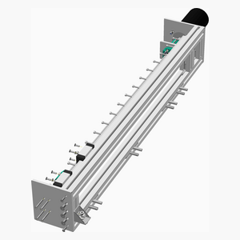

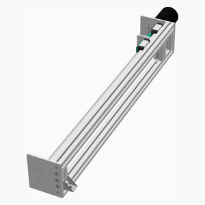

[Top](#TOP)

---

## Right Side Frame Assembly
### Vitamins
|Qty|Description|
|---:|:----------|
|1| Aluminium tooling plate 160mm x 160mm x 8mm|
|3| Ball bearing 6201-2RS 12mm x 32mm x 10mm|
|2| Extrusion E4040 x 1070mm|
|3| Extrusion E4040 x 80mm|
|1| Leadscrew 16 x 935mm, 10mm lead, 1 starts|
|1| Leadscrew nut for SFU1610|
|1| Linear rail HGH20CA x 1000mm|
|4| Nut M5 x 4mm nyloc|
|4| Screw M5 cap x 24mm|
|6| Screw M5 cs cap x 40mm|
|1| Servo 80ST standard mount 90 x 178mm|
|1| Smooth rod 10mm x 15mm|
|1| Smooth rod 12mm x 15mm|
|1| Smooth rod 12mm x 50mm|
|4| Washer  M5 x 10mm x 1mm|

### Assembly instructions
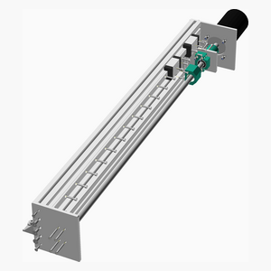

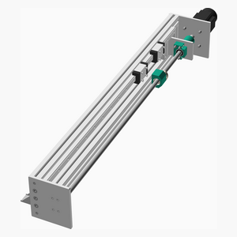

[Top](#TOP)

---

## 2 x Picker Assembly
### Vitamins
|Qty|Description|
|---:|:----------|
|4| Aluminium tooling plate 30mm x 30mm x 2mm|
|2| Linear rail MGN7 x 200mm|
|16| Screw M2 cs cap x  6mm|
|2| Stepper motor NEMA8 x 30mm|

### Assembly instructions
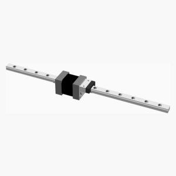

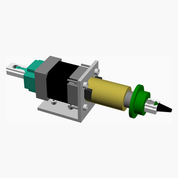

[Top](#TOP)

---

## Head Assembly
### Vitamins
|Qty|Description|
|---:|:----------|
|1| Aluminium tooling plate 100mm x 114mm x 8mm|
|1| Aluminium tooling plate 100mm x 240mm x 8mm|
|8| Screw M3 cs cap x 10mm|
|1| Stepper motor NEMA17 x 47mm|

### Sub-assemblies

| 2 x picker_assembly |
|---|
|  

### Assembly instructions
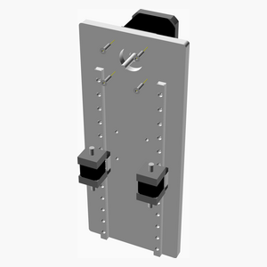

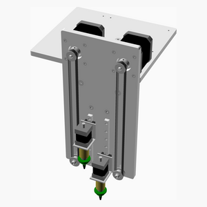

[Top](#TOP)

---

## Xaxis Assembly
### Vitamins
|Qty|Description|
|---:|:----------|
|1| Aluminium tooling plate 100mm x 250mm x 8mm|
|2| Aluminium tooling plate 50mm x 50mm x 8mm|
|2| Aluminium tooling plate 50mm x 50mm x 8mm|
|2| Aluminium tooling plate 60mm x 80mm x 8mm|
|1| Aluminium tooling plate 80mm x 100mm x 8mm|
|3| Ball bearing 6201-2RS 12mm x 32mm x 10mm|
|1| Extrusion E4080 x 1640mm|
|1| Leadscrew 16 x 1435mm, 10mm lead, 1 starts|
|1| Leadscrew nut for SFU1610|
|1| Linear rail HGH15CA x 1500mm|
|4| Nut M5 x 4mm nyloc|
|4| Screw M5 cap x 24mm|
|1| Servo 80ST standard mount 90 x 178mm|
|1| Smooth rod 10mm x 15mm|
|1| Smooth rod 12mm x 15mm|
|1| Smooth rod 12mm x 50mm|
|4| Washer  M5 x 10mm x 1mm|

### Sub-assemblies

| 1 x head_assembly |
|---|
|  

### Assembly instructions
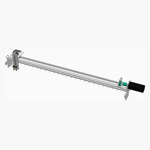

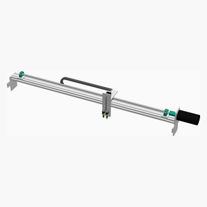

[Top](#TOP)

---

## Frame Assembly
### Vitamins
|Qty|Description|
|---:|:----------|
|5| Extrusion E4040 x 1500mm|

### Assembly instructions
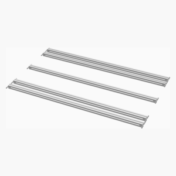

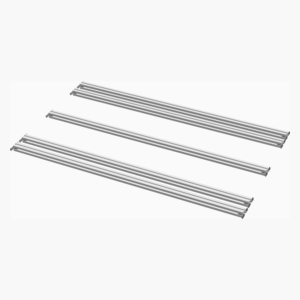

[Top](#TOP)

---

## Main Assembly
### Vitamins
|Qty|Description|
|---:|:----------|
|1| Aluminium tooling plate 1500mm x 645mm x 2mm|

### Sub-assemblies

| 1 x frame_assembly | 1 x left_side_frame_assembly | 1 x right_side_frame_assembly |
|---|---|---|
|  |  |  

| 1 x xaxis_assembly |
|---|
|  

### Assembly instructions
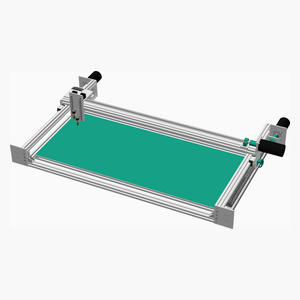

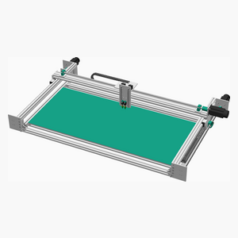

[Top](#TOP)
